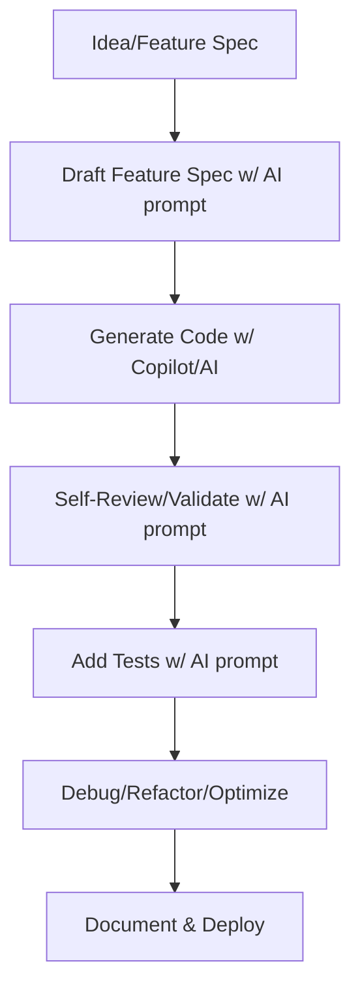
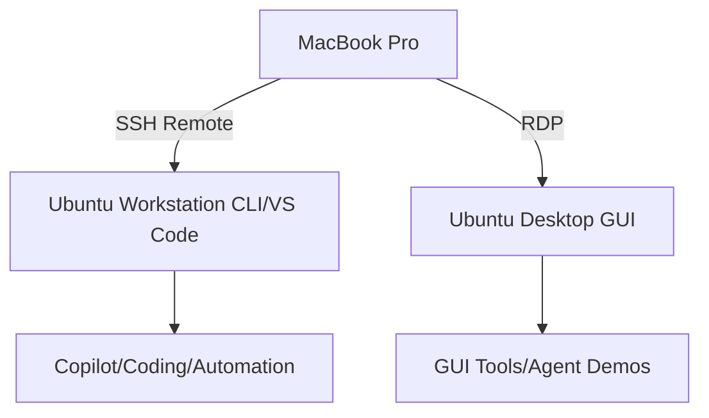

<!-- markdownlint-disable MD046 -->
# 🧑‍💻 AI Development Workflow Manual: Master Sheet

Welcome to my AI Development Workflow Manual — a living guide documenting my journey from low-code to advanced AI development. This manual is designed to be both a personal learning companion and a shareable playbook for building intelligent applications using modern tools like GitHub Copilot Pro, Ollama, LangChain, and more.

---

## 🚦 Agile Methodology (Solo Developer Adaptation)

This manual incorporates Agile methodology, tailored for a solo developer with a full-time job.  
Agile principles inform planning and delivery, but ceremonies and tooling are minimized for efficiency.

### Agile Practices (Current State)

- **Sprints:** Short, flexible cycles scoped to fit available time; no formal sprint boundaries.
- **Ceremonies:** No daily standups, sprint reviews, or retrospectives. Reflection is logged in a private learning journal or as occasional checklists.
- **Roles:** All roles (PM, dev, QA, ops) are filled by you.
- **Backlog & Tracking:** Managed with markdown lists, GitHub Issues, or simple tables.  
  **JIRA automation for epics/features/stories** is a future improvement (see Roadmap).
- **Daily Standups:** Not used.
- **Sprint Review/Retros:** Personal log or journal entry as time allows.
- **Testing:** Enforced for every module (see Testing section).
- **Collaboration:** All docs and specs are versioned for your own reference.

### Future Roadmap Item

- [ ] Automate epic/feature/story crgiteation and tracking via JIRA.  
      Integrate with workflow manual and system docs.

### Agile Principles (Adapted)

| Agile Practice      | Adaptation for Solo Workflow                |
|---------------------|---------------------------------------------|
| User Stories        | Prompt-driven markdown specs & tables        |
| Sprint Planning     | Lightweight, fits available bandwidth        |
| Backlog Management  | Markdown lists/issues; JIRA in future        |
| Standups            | Not used                                     |
| Sprint Review       | Personal log/journal                         |
| Retrospective       | Weekly/monthly journal reflection            |
| Testing             | Enforced for every module                    |
| Collaboration       | Self-documented, versioned                   |

---

## 📖 Table of Contents

- [🎯 Purpose](#purpose)
- [🧭 Development Environment](#development-environment)
- [🛠️ Development Style](#development-style)
- [📦 Initial Projects](#initial-projects)
- [📚 Manual Format](#manual-format)
- [🔄 Workflow Philosophy](#workflow-philosophy)
- [⚙️ Environment Setup](#environment-setup)
- [🧰 New to Ubuntu](#new-to-ubuntu)
- [🗂️ Project Planning](#project-planning)
- [💬 Prompting Strategies](#prompting-strategies)
- [🧩 Low-Code Patterns](#low-code-patterns)
- [🧪 Testing and Debugging](#testing-and-debugging)
- [📝 Coding with Copilot](#coding-with-copilot)
- [🚀 Deployment and Ops](#deployment-and-ops)
- [📊 Decision Frameworks](#decision-frameworks)
- [🔬 Burn-in & Promotion Workflow](#burn-in-promotion-workflow)
- [🛡️ Ops Guardrails & Risk Management](#ops-guardrails-risk-management)
- [🗒️ Docs Update Checklist](#docs-update-checklist)
- [🧠 Model Selection](#model-selection)
- [🧩 AI Agent Design](#ai-agent-design)
- [📓 Learning Journal](#learning-journal)
- [📚 Prompt Library](#prompt-library)

---

## 🎯 Purpose {#purpose}

This manual serves three core purposes:

1. **Learning Companion**  
   Documenting every step of my transition from low-code development to advanced workflows, with detailed explanations, prompts, and workflows.

2. **Development Playbook**  
   Capturing reusable patterns, best practices, and modular references for building AI-powered applications.

3. **Benchmarking & Innovation**  
   Using GitHub Copilot Pro as the benchmark, I aim to build my own AI Developer Agent that integrates into VS Code and eventually surpasses Copilot in usability and quality.

---

## � Documentation Conventions {#documentation-conventions}

To keep this playbook consistent and lint‑clean across renderers:

- Headings use explicit IDs: add `{#section-id}` to every H2+ that is linked in the ToC (stabilizes anchors across GitHub/Docs).
- Fenced code blocks always declare a language. Use:
  - `text` for prompts and natural language snippets
  - `bash`, `python`, `dockerfile`, `yaml`, `mermaid`, `makefile` as applicable
  - Surround every fence with a blank line before and after
- Lists are surrounded by blank lines; nested bullets use consistent two‑space indentation only when truly nested.
- Makefile examples must keep hard tabs in recipes. Wrap those fences with `<!-- markdownlint-disable MD010 -->` / `<!-- markdownlint-enable MD010 -->` locally.
- Avoid duplicate headings: disambiguate with contextual suffixes, e.g., “Recommendations (Deployment)”.

These conventions mirror markdownlint rules: MD051, MD024, MD031, MD032, MD040, MD010, MD036, MD047.

---

## �🧭 Development Environment {#development-environment}

**Primary Workstation:** Ubuntu 24.04.3 LTS  

- AMD Ryzen 7 9700X, AMD RX 7900 XTX (ROCm-enabled), dual NVMe storage  
- VS Code with GitHub Copilot Pro  
- Ollama for local model hosting  
- LangChain and LlamaIndex for agent design  
- Setup scripts, configs, and baseline captured in `/setup` and `/specs` folders

**Remote Access:** MacBook Pro  

- Connected via VS Code SSH Remote  
- RDP (Remote Desktop Protocol) for full GUI access to the Ubuntu workstation  
  - Install xrdp on Ubuntu, open port 3389, use Microsoft Remote Desktop client on MacBook Pro  
  - Enables direct GUI dev, running VS Code and tools as if local

### Environment Verification & Baseline Management

As environments are upgraded, run verification steps and capture outputs for reproducibility and troubleshooting.

> **Prompt:**
>
> Use the `environment-verify` prompt after any major upgrade or adjustment:
>
> ```text
> Verify the current environment setup by running and capturing outputs for:
> - uname -r
> - rocminfo | grep -i gfx
> - clinfo | grep -i 'gfx\|Device'
> - pip show ctranslate2 faster-whisper
> Summarize differences from previous baseline and flag any non-conformant results.
> Output a markdown table with captured outputs and dates.
> ```
>
> **When/Why:** After kernel, ROCm, or package upgrades; before/after burn-in; when prepping for deployment or troubleshooting.
>
> **How:** Run the commands, paste results into your specs table, and use the prompt to generate a summary and flag issues.

**Sample Output Table:**

| Command   | Output (truncated as needed)                   | Date       |
|-----------|------------------------------------------------|------------|
| uname -r  | 6.11.0-1027-oem                               | 2025-09-21 |
| rocminfo  | gfx1100 …                                      | 2025-09-21 |
| clinfo    | Device: gfx1100 …                              | 2025-09-21 |
| pip show  | ctranslate2 4.4.0 / faster-whisper 1.2.0       | 2025-09-21 |

---

## 🛠️ Development Style {#development-style}

- **Primary Approach:** Low-code development using Python, Copilot, modular design, and AI-assisted tools  
- **Primary Assistant:** GitHub Copilot Pro  
- **Long-Term Vision:** Build a custom AI Dev Agent integrated into VS Code

**Low-Code Strategy:**

- Use Python, Copilot, and advanced libraries to build, refactor, and automate.
- Modularize code for reusability and maintainability.
- Drive development with prompt-driven workflows and AI-powered automation.

---

## 📦 Initial Projects {#initial-projects}

The manual documents multiple AI-based applications, starting with:

1. **Meeting Assistant** *(priority project)*  
   - Summarizes meetings, integrates with Google Calendar, uses local LLMs.
   - Full spec and architecture captured; first testbed for workflow.

2. **Calendar Agent**  
3. **Smart Home Automation**  
4. **Interactive Family Calendar**  
5. **IoT Integrations**  
6. **Personal Assistant**

Each project includes architecture, workflow, and prompt-driven development logs.

---

## 📚 Manual Format {#manual-format}

- **Markdown-based GitHub repository**  
- **Narrative guide style** with embedded modular references  

- **Reference files** for:
  - Prompt templates  
  - Tool setup guides  
  - Architecture diagrams  
  - Reusable code snippets  
  - Learning journal entries

---

## 🔄 Workflow Philosophy {#workflow-philosophy}

- Agile, iterative development  
- Document-as-you-go  
- Clarity, reproducibility, shareability  
- Continuous benchmarking against Copilot Pro

### Mermaid Diagram: Prompt-Driven Development Workflow



---

## ⚙️ Environment Setup {#environment-setup}

### 🖥️ Primary Workstation: Ubuntu 24.04.3 LTS

#### Hardware Specs

- AMD Ryzen 7 9700X
- AMD RX 7900 XTX (ROCm-enabled)
- Dual NVMe storage

#### Software Stack

- VS Code (Copilot Pro, Copilot Labs, Python, ESLint/Prettier, Remote SSH)
- Python 3.11+, Node.js, Git, Docker (recommended)
- Ollama (local model hosting)
- LangChain / LlamaIndex

#### Setup Steps

1. Install VS Code and extensions.
2. Install Python and Node.js.
3. Install Git and Docker.
4. Set up Ollama (see [ollama.com](https://ollama.com)).
5. Clone repo and initialize workspace.

#### Environment Verification & Troubleshooting

> **Prompt:**
>
> After setup/upgrade, use `environment-verify` and `baseline-troubleshoot`:
>
> ```text
> Diagnose any issues with the current environment setup, referencing the baseline specs and captured outputs.
> Identify mismatches, missing dependencies, or known issues for the OS, kernel, GPU, ROCm, and primary packages.
> Recommend step-by-step fixes.
> ```
>
> **Scenario:** After upgrading ROCm, run the verification, capture outputs, and use this prompt to have your AI assistant flag and fix any issues.

#### Promotion to Stable

> **Prompt:**
>
> ```text
> Summarize burn-in and guardrail results for the current baseline.
> Recommend whether to promote to Stable, with rationale and next steps.
> Output a markdown checklist for promotion steps.
> ```
>
> Use after all tests pass; helps formalize environment management.

---

### 💻 Remote Access: MacBook Pro

#### VS Code SSH Remote

#### Setup (SSH Remote)

- Use VS Code Remote SSH extension.
- Configure SSH keys and firewall rules for secure CLI and code access.

#### Scenario & Workflow

After configuring SSH, use this prompt to generate step-by-step documentation and troubleshooting guidance:

```text
Generate documentation for setting up VS Code Remote SSH access from MacBook Pro to Ubuntu workstation, including SSH key creation, firewall configuration, and typical troubleshooting steps.
```

#### When/Why (SSH Remote)

Use for seamless remote CLI/code development, especially when you need shell access, file edits, or Copilot-driven workflows.

#### RDP (Remote Desktop Protocol) for Full GUI Access

#### Setup (RDP)

- Install and configure an RDP server on Ubuntu (e.g., xrdp).
- Ensure firewall allows RDP traffic (default port 3389).
- Use Microsoft Remote Desktop client on MacBook Pro to connect.

#### Step-by-Step Example (RDP)

1. **Install xrdp on Ubuntu:**

```bash
  sudo apt update
  sudo apt install xrdp
  sudo systemctl enable xrdp
  sudo systemctl start xrdp
```

1. **(Optional) Configure your firewall:**

  ```bash
  sudo ufw allow 3389/tcp
  ```

1. **Verify xrdp is running:**

  ```bash
  systemctl status xrdp
  ```

1. **Connect from MacBook Pro:**

- Open Microsoft Remote Desktop (free in Mac App Store).
- Add a new PC, enter your Ubuntu workstation's IP and credentials.
- Connect for full GUI access to your Ubuntu desktop.

#### Prompt to Generate Troubleshooting Guide (RDP)

```text
Generate a troubleshooting guide for xrdp remote desktop connection issues between MacBook Pro and Ubuntu workstation, including firewall, authentication, and desktop environment compatibility.
```

#### When/Why (RDP)

Use RDP when you need graphical access to Ubuntu apps, VS Code with full extensions, or to run/monitor GUI-based tools.

#### Integrated Workflow (Remote Access)

- Use SSH Remote for lightweight remote dev and CLI tasks.
- Use RDP for GUI development, debugging, and workflow visualization.

### Mermaid Diagram: Remote Access Flow



---

### 🧠 AI Dev Agent Integration (Planned)

- Embed custom AI Dev Agent into VS Code.
- Use Ollama-hosted models for local inference.
- Compare with Copilot Pro usability and quality.

---

### ✅ Recommendations

- Use Poetry or Pipenv for Python dependency management.
- Create Makefile or task runner for automation.
- Use Mermaid for architecture diagrams.
- Document setup scripts and configs in `/setup` folder.

---

## 🧰 New to Ubuntu {#new-to-ubuntu}

This section provides essential tips, shortcuts, and maintenance guidance for working effectively with Ubuntu, especially for AI development workflows.

### ⌨️ Essential Keyboard Shortcuts

| Shortcut            | Action                                      |
|---------------------|---------------------------------------------|
| `Ctrl+Alt+T`        | Open terminal                               |
| `Super` (Windows key)| Open application launcher                   |
| `Alt+Tab`           | Switch between applications                 |
| `Super+Left/Right`  | Snap window to left/right half of screen    |
| `Super+Up/Down`     | Maximize/minimize window                    |
| `Ctrl+Alt+Arrow`    | Switch workspaces                           |
| `Super+D`           | Show desktop (minimize all windows)         |
| `Alt+F2`            | Run command dialog                          |
| `Super+L`           | Lock screen                                 |
| `Ctrl+Alt+Delete`   | Power options/log out                       |

### 🖥️ Terminal Commands for System Info

```bash
# System version info
lsb_release -a             # Ubuntu version
uname -a                   # Kernel version and system architecture

# Hardware info
lscpu                      # CPU information
lspci | grep -i vga        # GPU information
free -h                    # Memory usage
df -h                      # Disk space usage
lsblk                      # Block devices (disks and partitions)
sensors                    # Temperature sensors

# Network info
ip a                       # Network interfaces and IP addresses
ss -tuln                   # Open ports
```

### 🧹 System Cleaning & Maintenance

#### Routine Maintenance (Weekly)

```bash
# Update package lists and upgrade packages
sudo apt update
sudo apt upgrade

# Remove unused packages
sudo apt autoremove

# Clean package cache
sudo apt clean

# Check disk space
df -h

# Check system journal for errors
journalctl -p 3 -xb
```

#### Deep Cleaning (Monthly)

```bash
# Remove old kernel versions (keep last 2)
sudo apt autoremove --purge

# Clear journal logs
sudo journalctl --vacuum-time=7d

# Clean thumbnail cache
rm -rf ~/.cache/thumbnails/*

# Find large files (>100MB)
find ~/ -type f -size +100M | sort -h

# Check and repair filesystem
sudo fsck -f /dev/sdXY  # Replace with your partition, run when unmounted
```

### 🚀 Performance Optimization

#### GPU-Specific (AMD)

```bash
# Check ROCm driver status
rocminfo
clinfo

# Monitor GPU usage
radeontop
watch -n 1 "rocm-smi"

# Set GPU power profile for performance
sudo bash -c "echo high > /sys/class/drm/card0/device/power_dpm_force_performance_level"
```

#### System Tweaks

```bash
# Reduce swap usage (0-100, higher means less swapping)
sudo sysctl vm.swappiness=10

# Enable CPU performance governor
sudo apt install cpufrequtils
sudo cpufreq-set -g performance

# Temporary file cleanup
sudo sysctl -w vm.drop_caches=3
```

### 🔧 Troubleshooting Common Issues

#### System Freezes

- Switch to TTY: `Ctrl+Alt+F3`
- Check resources: `top` or `htop`
- Kill processes: `killall -9 process_name`
- Return to GUI: `Ctrl+Alt+F2`
- Switch to TTY: `Ctrl+Alt+F3`
- Check resources: `top` or `htop`
- Kill processes: `killall -9 process_name`
- Return to GUI: `Ctrl+Alt+F2`

#### Package Management Issues

```bash
# Fix broken packages
sudo apt --fix-broken install

# Reset package database
sudo dpkg --configure -a

# Force reinstall package
sudo apt install --reinstall package_name
```

#### Display/GPU Issues

```bash
# Reset GNOME settings
dconf reset -f /org/gnome/

# Restart display server (will log you out)
sudo systemctl restart gdm
```

#### Permission Problems

```bash
# Fix home directory permissions
sudo chown -R $USER:$USER $HOME

# Check for files not owned by you
find $HOME -not -user $USER
```

### 🛡️ Security Best Practices

- Update system regularly: `sudo apt update && sudo apt upgrade`
- Enable firewall: `sudo ufw enable`
- Check for rootkits: `sudo apt install rkhunter && sudo rkhunter --check`
- Encrypt sensitive data: `sudo apt install cryptsetup`
- Check open ports: `sudo netstat -tulpn`

### 📝 Useful Applications

- **Timeshift**: System backup and restore (`sudo apt install timeshift`)
- **Stacer**: System optimizer and monitor (`sudo apt install stacer`)
- **Htop**: Interactive process viewer (`sudo apt install htop`)
- **Glances**: System monitoring tool (`sudo apt install glances`)
- **Neofetch**: System info display (`sudo apt install neofetch`)

### 💾 Creating Custom Scripts

Store useful scripts in `~/bin` and make them executable:

```bash
mkdir -p ~/bin
nano ~/bin/system-check.sh
```

Example script (system-check.sh):

```bash
#!/bin/bash
# System health check script

echo "===== System Info ====="
uname -a
echo

echo "===== Disk Space ====="
df -h /
echo

echo "===== Memory Usage ====="
free -h
echo

echo "===== CPU Usage ====="
top -bn1 | head -20
echo

echo "===== GPU Status ====="
rocm-smi
```

Make executable and run:

```bash
chmod +x ~/bin/system-check.sh
~/bin/system-check.sh
```

---

## 🗂️ Project Planning {#project-planning}

This section shows how to plan AI-based development projects using Copilot Pro and prompt-driven low-code strategies.

### 🎯 Planning Philosophy

- Start with **plain English descriptions**.
- Use Copilot Chat and AI prompts to break down tasks, generate scaffolds, and iterate.
- Document everything for reproducibility.

### 🧠 Using Copilot & Prompts for Planning

**Workflow:**

1. **Draft Feature Specification**

- **Prompt:** `draft-feature-spec`

```text
      You are an expert product engineer helping to create a complete, high-quality feature specification.
      Ask me structured questions in sequence to gather:
        1. Feature overview (purpose, user story, scope)
        2. Functional requirements (inputs, outputs, core logic, edge cases)
        3. Technical context (language, framework, dependencies, environment, performance targets)
        4. Data & storage details (schema, persistence, validation)
        5. Security & compliance requirements
        6. Testing expectations
        7. Documentation needs
        8. High-level acceptance criteria: list testable outcomes and edge case coverage for feature completion.
      After gathering all answers, output a clean, copy-ready Markdown specification following the Feature Specification Guide format.
```

- **Feature Spec Template Example:**

```markdown
      ## Feature Overview
      - Purpose:
      - User Story:
      - Scope:

      ## Functional Requirements
      - Inputs:
      - Outputs:
      - Core Logic:
      - Edge Cases:

      ## Technical Context
      - Language:
      - Framework:
      - Dependencies:
      - Environment:
      - Performance Targets:

      ## Data & Storage
      - Schema:
      - Persistence:
      - Validation:

      ## Security & Compliance
      - Security Measures:
      - Compliance Requirements:

      ## Testing Expectations
      - Required Tests:
      - Coverage Goals:

      ## Documentation Needs
      - Usage Examples:
      - API Docs:

      ## Acceptance Criteria
      - [ ] Clearly defined, testable outcomes for feature completion
      - [ ] Edge case coverage
      - [ ] Performance, security, or compliance requirements as appropriate
```

1. **Break Down Features into User Stories**

- **Prompt:**  

```text
      You are an expert product manager.
      Given a feature description, break it down into user stories in the format:
      - As a <user type>, I want to <action/goal>, so that <value/benefit>.
      For each user story, include:
        - A brief Description (context, rationale, background)
        - Detailed Acceptance Criteria (checklist covering functional, edge case, and non-functional requirements)
      Output as a markdown table and AC checklist.
```

- **User Stories Template (Detailed Version):**

```markdown
      | As a... | I want to... | So that... | Description |
      |---------|--------------|------------|-------------|
      | ...     | ...          | ...        | ...         |

      ## Acceptance Criteria
      - [ ] AC 1
      - [ ] AC 2
      - [ ] AC 3
```

- **For rapid brainstorming:** Use a simple version (table only). For robust planning, use the detailed template above.

1. **Refine Feature Specification**

- **Prompt:** `refine-feature-spec`
- **When/Why:** After your initial spec, before starting code.
- **How:**  

```text
      Review the provided feature specification for:
      - Missing or unclear details
      - Ambiguities that could cause incorrect implementation
      - Opportunities to improve clarity, completeness, and testability
      Suggest specific additions or changes, then output the improved specification in clean Markdown.
```

- **Scenario:**  
  "Here's my meeting assistant spec. What's missing? Where could it be clearer?"

1. **Scaffold Project Structure**

- **Prompt:**  

```text
      "Suggest a folder structure for a meeting assistant that uses local LLMs."
```

- **Scenario:**  
  Copilot generates:

```text
      meeting-assistant/
      ├── README.md
      ├── src/
      │   ├── main.py
      │   ├── calendar_integration.py
      │   └── summarizer.py
      ├── tests/
      │   └── test_main.py
  ├── data/
      └── docs/
```

1. **Task Board Generation**
    - Use Copilot to create TODOs and planning boards.

#### Mermaid Diagram: Planning Workflow

```mermaid
flowchart TD
    A[Feature Idea/Request] --> B[Draft Spec (AI prompt)]
    B --> C[Refine Spec (AI prompt)]
    C --> D[Scaffold Project Structure]
    D --> E[Break Down Features]
    E --> F[Create Task Board]
```

**Recommendations:**

- Use GitHub Projects or Issues to track tasks.
- Save planning prompt/response pairs in `/planning` for future reuse.
- Review and refine Copilot-generated plans before implementation.

---

## 💬 Prompting Strategies {#prompting-strategies}

Explore how to write effective prompts for Copilot Pro and other AI tools to maximize productivity and code quality.

### 🎯 Prompting Philosophy

- Be **specific** (clear goals).
- Be **contextual** (reference variables, file names, etc.).
- Be **iterative** (refine based on outputs).
- Be **modular** (break complex tasks into smaller prompts).

### Prompt Types & Examples

1. **Task Prompts**
    - **Prompt:**  

      ```text
      "Create a Python function that fetches weather data from OpenWeather API."
      ```

    - **Scenario:**  
      Use for discrete coding tasks; Copilot generates code function.

2. **Planning Prompts**
    - **Prompt:**  

      ```text
      "Suggest a folder structure for a meeting assistant that uses local LLMs."
      ```

    - **Scenario:**  
      For scaffolding and architecture guidance.

3. **Debugging Prompts**
    - **Prompt:**  

      ```text
      "Why is this function returning None instead of a string?"
      ```

    - **Scenario:**  
      Use when you hit bugs; Copilot diagnoses and suggests fixes.

4. **Explanation Prompts**
    - **Prompt:**  

      ```text
      "Explain what this regex pattern does."
      ```

    - **Scenario:**  
      For learning and documentation.

### Context-Aware Prompting

Copilot performs better with context:

- Reference variables, modules, file names.
- Use descriptive comments:

```python
# Fetch weather data from OpenWeather API
# Include error handling and logging
```

### Prompt Testing & Library

- Try multiple phrasings; compare results.
- Save successful prompts in `/prompts`.
- Document prompt/response pairs for reuse.

### Recommendations (Prompting Strategies)

- Build a categorized prompt library.
- Use Copilot Chat for exploratory prompting.
- Always review/refine generated code.

---

## 🧩 Low-Code Patterns {#low-code-patterns}

Robust strategies for building AI applications using low-code workflows and AI assistance.

### 🧠 Philosophy

- Use Python, Copilot, and advanced libraries for rapid prototyping and automation.
- Modularize code for clarity and reuse.
- Drive development with prompt-driven workflows and AI-powered automation.

### Common Low-Code Patterns

- **Function Templates**
  *Prompt:*  

  ```text
  # Summarize meeting transcript using local LLM
  ```
  
  *Scenario:* Generate reusable Python functions for meeting summarization.

- **Modular File Structure**
  *Prompt:*  

  ```text
  "Create a class that manages calendar events and integrates with Google Calendar API."
  ```
  
  *Scenario:* Build modular, maintainable codebases.

- **Prompt-Driven Development**
  *Workflow:*  
  - Draft spec
  - Use AI prompts for scaffolding and code generation
  - Self-review and test (AI prompt)
  - Deploy and automate

- **Copilot Refactoring**
  *Prompt:*  

  ```text
  Refactor the provided code to:
    - Improve naming and structure
    - Reduce complexity
    - Add docstrings and inline comments
    - Preserve all functionality
  Output only the refactored code.
  ```
  
  *Scenario:* Simplify and clean up code as the project matures.

### Mermaid Diagram: Low-Code Development Workflow

```mermaid
flowchart TD
    A[Draft Spec] --> B[Low-Code Scaffold (Python/Copilot/AI)]
    B --> C[Refactor/Expand with Copilot]
    C --> D[Test & Optimize (AI prompt)]
    D --> E[Deploy/Automate]
```

### Testing Patterns

- Generate unit tests for each module:
  *Prompt:*  

  ```text
  Write comprehensive unit tests for the provided code.
  - Cover normal, edge, and error cases.
  - Use pytest style unless otherwise specified.
  - Include fixtures if needed.
  Output only the test code.
  ```

- Validate edge cases and error handling using prompt-driven test generation.

### AI Agent Patterns

- Use LangChain for chaining tasks and tools.
- Use Ollama for local model inference.
- Design agents with modular tools and memory.

**Scenario:**  
Build a Meeting Assistant agent that chains calendar integration, transcript summarization, and email sending.

### Recommendations (Low-Code Patterns)

- Document each pattern with purpose and usage.
- Use Mermaid diagrams to visualize workflows.
- Maintain a `/patterns` folder with reusable code and UI snippets.

---

## 🧪 Testing and Debugging {#testing-and-debugging}

This section covers how to use Copilot Pro and other tools to write tests, identify bugs, and debug code effectively in low-code AI workflows.

### ✅ Testing Philosophy

- Write tests early and often
- Use Copilot to generate unit tests and edge cases
- Validate Copilot-generated code with automated tests
- Document test strategies and results

### 🧪 Writing Tests with Copilot

Use Copilot Chat to:

- Generate unit tests for functions and modules
- Suggest edge cases and input variations
- Create test files and organize them in `/tests`

**Example Prompt:**

```text
"Generate unit tests for a function that summarizes meeting transcripts."
```

**Example Structure:**

```text
tests/
├── test_main.py
├── test_calendar_integration.py
└── test_summarizer.py
```

### 🐞 Debugging with Copilot

Use Copilot Chat to:

- Explain error messages
- Suggest fixes and refactoring
- Identify logic flaws or missing conditions

**Example Prompts:**

```text
"Explain what this function does."
"Refactor this to use async/await."
"Generate unit tests for this module."
```

### 🧰 Recommended Tools

- `pytest` for Python testing
- `unittest` for built-in test framework
- `Copilot Labs` for experimental debugging features
- `logging` module for runtime diagnostics

### 📌 Best Practices

- Keep tests in a dedicated `/tests` folder
- Use descriptive test names and assertions
- Run tests automatically before commits
- Document test coverage and known issues

### 📁 Prompt Library

Save useful testing and debugging prompts in a `/prompts/testing-debugging.md` file for reuse.

---

## 📝 Coding with Copilot {#coding-with-copilot}

This section covers how to use GitHub Copilot Pro effectively for writing, editing, and understanding code. It includes inline suggestions, Copilot Chat workflows, and best practices.

### Inline Suggestions

Copilot provides real-time code completions as you type:

- Use comments to guide suggestions
- Write descriptive function headers
- Let Copilot autocomplete boilerplate code

**Example:**

```python
# Create a function to fetch weather data from OpenWeather API
```

### Copilot Chat Workflows

Use Copilot Chat to:

- Ask questions about code
- Request refactoring or optimization
- Generate tests and edge cases
- Troubleshoot bugs and errors

**Example Prompts:**

```text
"Explain what this function does."
"Refactor this to use async/await."
"Generate unit tests for this module."
```

### Best Practices

- Keep prompts specific and contextual
- Use comments to guide inline suggestions
- Review and edit Copilot-generated code
- Use Copilot Chat for planning and debugging

### Copilot Labs (Optional)

Explore experimental features:

- Code translation (e.g., Python to JavaScript)
- Test generation
- Brush and explain modes

### Recommendations (Copilot Usage)

- Use Copilot for repetitive or boilerplate tasks
- Combine inline suggestions with Chat for full workflows
- Save useful prompts and completions in a `/copilot` folder

---

## 🚀 Deployment and Ops {#deployment-and-ops}

This section outlines strategies for deploying AI-based applications and managing operations, including local hosting, remote access, and automation.

### 🧠 Deployment Philosophy

- Start with local deployment for fast iteration
- Use remote access for flexibility and scalability
- Automate setup and updates with scripts and containers

### 🖥️ Local Deployment

- Use Python scripts and VS Code for local testing
- Host models with Ollama on Ubuntu workstation
- Run agents and services via terminal or task runners

**Example:**

```bash
python src/main.py
```

### 🌐 Remote Access

- Connect via VS Code SSH Remote from MacBook Pro
- Use RDP for GUI development and monitoring
- Use secure SSH keys and firewall rules

**Example:**

```bash
ssh user@your-ubuntu-ip
```

### 🐳 Containerization (Optional)

- Use Docker to package and run services
- Create Dockerfiles for reproducible environments
- Use `docker-compose` for multi-service orchestration

**Example Dockerfile:**

```Dockerfile
FROM python:3.11
WORKDIR /app
COPY . .
RUN pip install -r requirements.txt
CMD ["python", "src/main.py"]
```

### 🔁 Automation

- Use Makefiles or shell scripts for common tasks
- Automate testing, deployment, and updates

**Example Makefile:**

<!-- markdownlint-disable MD010 -->

```makefile
run:
	python src/main.py

test:
	pytest tests/
```

<!-- markdownlint-enable MD010 -->

### 📈 Monitoring and Logging

- Use Python `logging` module for diagnostics
- Track performance and errors
- Document known issues and resolutions

### ✅ Recommendations (Deployment)

- Maintain a `/deployment` folder with scripts and configs
- Document setup steps and troubleshooting tips
- Use GitHub Actions for CI/CD if needed

---

## 📊 Decision Frameworks {#decision-frameworks}

Use a lightweight scoring model when pinning versions or choosing components.

- Scoring criteria (1–5): Latency Fit, Accuracy Fit, Maintainability Fit
- Weights: Latency 40%, Accuracy 40%, Maintainability 20%
- Data sources: quick benchmarks, logs, public release notes
- Decision rules:
  - Stable = highest weighted total ≥ 4.0 with no recent P1/P2 issues
  - Newest = latest GA within 0.4 of Stable and passes smoke tests

Quick prompt

```text
Given candidates A/B for <component>, score 1–5 on Latency, Accuracy, Maintainability.
Apply weights 40/40/20 and recommend Stable/Newest with 2 risks + mitigations.
```

---

## 🔬 Burn-in & Promotion Workflow {#burn-in-promotion-workflow}

Goal: Prove the baseline before calling it Stable.

Checklist

- Build from clean environment; pin versions in build-spec/env files
- Run smoke tests: start/stop, basic feature path, logs clean of errors
- Run burn-in: representative workload for 60–120 minutes
- Verify SLAs: latency targets and success-rate thresholds
- Capture artifacts: metrics, logs, diffs vs previous baseline
- Decision: Promote to Stable or roll back

Promotion prompt

```text
Summarize burn-in results for <baseline>. Did we meet SLAs?
List defects found, mitigations, and final promote/defer decision with rationale.
Output a markdown checklist of the promotion steps completed.
```

---

## 🛡️ Ops Guardrails & Risk Management {#ops-guardrails-risk-management}

Guardrails

- Always keep last Stable kernel/runtime bootable
- Document every promotion with version, date, rationale, rollback
- Dry-run integrations by default; explicit approval to send
- Privacy: local-only processing for sensitive content

Risks → mitigations

- Model/regression: keep version-locked models; canary replay recent tasks
- Latency spikes: auto-fallback to lighter model; batch heavy jobs off-hours
- Storage growth: tiered retention; weekly size budgets
- Auth lapses: alerts + CLI re-auth; file-based fallback where possible

Escalation checklist

- Triage severity (P1–P3), capture minimal repro
- Collect logs/metrics and recent changes
- Roll back to last Stable if user impact persists > 30 min (P1)

---

## 🗒️ Docs Update Checklist {#docs-update-checklist}

When behavior changes, update the docs alongside the change.

- Update: feature specs, ops steps, known issues, baselines
- Verify ToC anchors and internal links (MD051 compliant)
- Add a drift note: what changed, why, when, who
- Commit message includes: [docs] prefix + scope + rationale

Quick prompt

```text
Create a concise docs update for change <X>: affected sections, steps changed,
and an anchor-safe ToC entry if a new section was added.
```

---

## 🧠 Model Selection {#model-selection}

This section outlines how to choose the right AI models for your development tasks, including local models via Ollama and cloud-based options like OpenAI.

### 🎯 Selection Philosophy

- Choose models based on task complexity, latency, and privacy
- Prefer local models for fast iteration and secure data handling
- Use cloud models for advanced reasoning and large-scale tasks

### 🧩 Model Categories

1. **Code Generation**
    - `codellama` (local via Ollama)
    - `code-davinci-002` (OpenAI)

2. **General Reasoning**
    - `llama2` (local)
    - `gpt-4` (OpenAI)
    - `mistral` (local)

3. **Summarization & NLP**
    - `llama2` fine-tuned
    - `gpt-3.5-turbo`
    - `mistral` with RAG (retrieval-augmented generation)

### 🖥️ Local vs Cloud Models

| Criteria         | Local Models (Ollama) | Cloud Models (OpenAI) |
|------------------|------------------------|------------------------|
| Latency          | ✅ Fast                | ⚠️ Variable            |
| Privacy          | ✅ High                | ⚠️ Depends on provider |
| Cost             | ✅ Free (after setup)  | ⚠️ Subscription-based  |
| Capabilities     | ⚠️ Limited context     | ✅ Advanced reasoning  |

### 🛠️ Integration Tips

- Use Ollama to host models locally
- Use LangChain to abstract model calls
- Benchmark models using the same tasks

**Example:**

```python
from langchain.llms import Ollama
llm = Ollama(model="codellama")
response = llm("Summarize this meeting transcript")
```

### ✅ Recommendations (Models)

- Maintain a `/models` folder with config and usage notes
- Document model performance and limitations
- Use prompt libraries to test model behavior

---

## 🧩 AI Agent Design {#ai-agent-design}

This section outlines strategies and architecture for designing AI agents using local models, LangChain, and VS Code integration. It includes modular design principles, tool chaining, and memory management.

### Design Philosophy

- Build agents as modular, composable systems
- Use local models for privacy and performance
- Integrate agents into development tools (e.g., VS Code)
- Benchmark against GitHub Copilot Pro

### Core Components

1. **Task Modules**
    - Calendar integration
    - Meeting summarization
    - Prompt generation

2. **Tool Interfaces**
    - LangChain tools for API calls, file access, and logic
    - Ollama models for local inference

3. **Memory Systems**
    - Short-term memory for session context
    - Long-term memory for persistent knowledge

### Architecture Overview

Use LangChain to:

- Chain tools and models together
- Define agent behavior and responses
- Manage context and memory

**Example:**

```python
from langchain.agents import initialize_agent
from langchain.llms import Ollama

llm = Ollama(model="codellama")
agent = initialize_agent(tools, llm, agent_type="zero-shot")
```

### VS Code Integration

- Embed agent into VS Code using extensions
- Use terminal commands or chat interface
- Enable prompt-driven workflows and automation

### Recommendations (Agents)

- Maintain a `/agents` folder with agent configs and modules
- Document each tool and memory strategy
- Use Mermaid diagrams to visualize agent workflows

---

## 📓 Learning Journal {#learning-journal}

This section is a personal log of discoveries, challenges, and reflections throughout the AI development journey. It helps track growth, document insights, and revisit key learnings.

### Journal Philosophy

- Capture learnings in real time
- Reflect on successes and failures
- Document questions and answers
- Track evolution from low-code to advanced AI workflows

### Entry Format

Each entry includes:

- **Date**
- **Topic or Task**
- **What I Learned**
- **Challenges Faced**
- **Next Steps**

### Sample Entry

#### Date: 2025-09-21

#### Topic: Setting Up VS Code with Copilot Pro

**What I Learned:**

- How to install and configure GitHub Copilot Pro
- How to use inline suggestions and Copilot Chat

**Challenges Faced:**

- Initial confusion with SSH Remote setup
- Needed to adjust VS Code settings for optimal performance

**Next Steps:**

- Document SSH setup in environment section
- Explore Copilot Labs features

### Recommendations (Learning Journal)

- Maintain entries in chronological order
- Use tags or categories for quick reference
- Review journal weekly to reinforce learning

---

## 📚 Prompt Library {#prompt-library}

All prompts used in this manual, organized for quick reference:

```yaml
- name: build-feature
  description: Generate production‑ready code from a natural language spec
  model: codellama13b
  prompt: |
    You are an expert software engineer. Based on the following specification,
    generate complete, production‑ready code.
    - Include docstrings and inline comments.
    - Follow Python best practices (PEP 8) unless otherwise specified.
    - If the spec is ambiguous, ask clarifying questions before coding.
    - Output only the code block unless explicitly asked for explanation.
- name: build-and-validate
  description: Generate code and then self‑review it for correctness
  model: codellama13b
  prompt: |
    Step 1: Generate the requested code based on the specification.
    Step 2: Review your own output for:
      - Logical correctness
      - Syntax errors
      - Missing edge cases
      - Security vulnerabilities
    Step 3: Provide the corrected final version.
    Output the reviewed code only, unless explicitly asked for the review notes.
- name: refactor-for-clarity
  description: Improve readability, maintainability, and structure
  model: gemma3_12b
  prompt: |
    Refactor the provided code to:
      - Improve naming and structure
      - Reduce complexity
      - Add docstrings and inline comments
      - Preserve all functionality
    Output only the refactored code.
- name: add-tests
  description: Generate unit tests for existing code
  model: deepseekcoder6.7b
  prompt: |
    Write comprehensive unit tests for the provided code.
    - Cover normal, edge, and error cases.
    - Use pytest style unless otherwise specified.
    - Include fixtures if needed.
    Output only the test code.
- name: security-review
  description: Audit code for vulnerabilities and suggest fixes
  model: codellama13b
  prompt: |
    Review the provided code for:
      - Security vulnerabilities
      - Insecure coding patterns
      - Missing validation or sanitization
    Suggest specific fixes and explain why they are needed.
- name: optimize-performance
  description: Improve efficiency and speed of the code
  model: deepseekcoder6.7b
  prompt: |
    Analyze the provided code for performance bottlenecks.
    Suggest and implement optimizations to improve speed and reduce resource
    usage.
    Ensure the optimized code maintains the same functionality.
    Output only the optimized code.
- name: explain-code
  description: Provide a detailed explanation of the code's functionality
  model: gemma3_12b
  prompt: |
    Explain the functionality of the provided code in detail.
    - Describe the purpose of the code.
    - Explain how it works step-by-step.
    - Highlight any important design decisions or patterns used.
    Output the explanation in clear, concise language.
- name: translate-language
  description: Convert code from one programming language to another
  model: codellama13b
  prompt: |
    Translate the provided code from its current programming language to the
    specified target language.
    - Preserve the original functionality.
    - Follow best practices and idioms of the target language.
    - Include comments and docstrings as appropriate.
    Output only the translated code.
- name: generate-documentation
  description: Create comprehensive documentation for the codebase
  model: codellama13b
  prompt: |
    Generate detailed documentation for the provided code.
    - Include an overview of the code's purpose and functionality.
    - Document key classes, functions, and modules.
    - Provide usage examples where applicable.
    Output the documentation in markdown format.
- name: debug-code
  description: Identify and fix bugs in the provided code
  model: deepseekcoder6.7b
  prompt: |
    Analyze the provided code to identify any bugs or issues.
    Suggest specific fixes and implement them.
    Ensure the fixed code maintains the same functionality.
    Output only the corrected code.
- name: code-review
  description: Review code for quality, style, and best practices
  model: codellama13b
  prompt: |
    Review the provided code for:
      - Code quality
      - Adherence to style guidelines
      - Use of best practices
    Suggest specific improvements and explain why they are needed.
- name: integrate-library
  description: Add and configure a new library or framework in the codebase
  model: codellama13b
  prompt: |
    Integrate the specified library or framework into the provided codebase.
    - Add necessary import statements.
    - Configure the library as needed.
    - Update existing code to utilize the new library.
    Output only the updated code.
- name: full-feature-pipeline
  description: Build, validate, test, and optimize a feature in one run
  model: codellama13b
  prompt: |
    You are an expert software engineer. Follow these steps:
    1. Generate production-ready code from the given specification.
    2. Review your own output for correctness, syntax errors, missing edge cases, and security vulnerabilities. Correct any issues.
    3. Generate comprehensive pytest-style unit tests for the corrected code.
    4. Optimize the corrected code for performance without changing functionality.
    Output in this order:
      - Final optimized code
      - Unit tests
      - Brief summary of changes and optimizations
- name: draft-feature-spec
  description: Interactive Q&A to build a complete feature specification
  model: llama3
  prompt: |
    You are an expert product engineer helping to create a complete, high-quality feature specification.
    Ask me structured questions in sequence to gather:
      1. Feature overview (purpose, user story, scope)
      2. Functional requirements (inputs, outputs, core logic, edge cases)
      3. Technical context (language, framework, dependencies, environment, performance targets)
      4. Data & storage details (schema, persistence, validation)
      5. Security & compliance requirements
      6. Testing expectations
      7. Documentation needs
      8. High-level acceptance criteria: list testable outcomes and edge case coverage for feature completion.
    After gathering all answers, output a clean, copy-ready Markdown specification following the Feature Specification Guide format.
- name: user-stories-detailed
  description: Break down a feature into detailed user stories with description and acceptance criteria
  model: llama3
  prompt: |
    You are an expert product manager.
    Given a feature description, break it down into user stories in the format:
    - As a <user type>, I want to <action/goal>, so that <value/benefit>.
    For each user story, include:
      - A brief Description (context, rationale, background)
      - Detailed Acceptance Criteria (checklist covering functional, edge case, and non-functional requirements)
    Output as a markdown table and AC checklist.
- name: refine-feature-spec
  description: Review and improve an existing feature specification
  model: llama3
  prompt: |
    You are an expert product engineer and technical writer.
    Review the provided feature specification for:
      - Missing or unclear details
      - Ambiguities that could cause incorrect implementation
      - Opportunities to improve clarity, completeness, and testability
    Suggest specific additions or changes, then output the improved specification in clean Markdown.
- name: feature-specification-guide
  description: Guidelines for writing high-quality feature specifications
  model: llama3
  prompt: |
    Use the following guidelines to write high-quality feature specifications:
      1. **Feature Overview**: Start with a clear purpose, user story, and scope.
      2. **Functional Requirements**: Detail inputs, outputs, core logic, and edge cases.
      3. **Technical Context**: Specify language, framework, dependencies, environment, and performance targets.
      4. **Data & Storage**: Define data schema, persistence, and validation needs.
      5. **Security & Compliance**: Outline any security measures or compliance requirements.
      6. **Testing Expectations**: Describe required tests and coverage goals.
      7. **Documentation Needs**: Note any documentation or usage examples required.
      8. **Acceptance Criteria**: Define clear, testable conditions for feature completion, including edge cases and non-functional requirements.
      Follow this structure and be as specific as possible to ensure a comprehensive and actionable feature specification.
- name: environment-verify
  description: Verify software/hardware environment and compare to baseline
  model: codellama13b
  prompt: |
    Verify the current environment setup by running and capturing outputs for:
    - uname -r
    - rocminfo | grep -i gfx
    - clinfo | grep -i 'gfx\|Device'
    - pip show ctranslate2 faster-whisper
    Summarize differences from previous baseline and flag any non-conformant results.
    Output a markdown table with captured outputs and dates.
- name: baseline-troubleshoot
  description: Troubleshoot environment setup against baseline specs
  model: codellama13b
  prompt: |
    Diagnose any issues with the current environment setup, referencing the baseline specs and captured outputs.
    Identify mismatches, missing dependencies, or known issues for the OS, kernel, GPU, ROCm, and primary packages.
    Recommend step-by-step fixes.
- name: ubuntu-system-maintenance
  description: Generate commands for Ubuntu system maintenance and optimization
  model: codellama13b
  prompt: |
    Generate a comprehensive list of commands for Ubuntu system maintenance:
    - System updates and package management
    - Disk cleanup and space optimization
    - Performance monitoring and tuning
    - Security checks and hardening
  Format as a markdown guide with explanations for each command.
```

---

## End of Master Sheet
